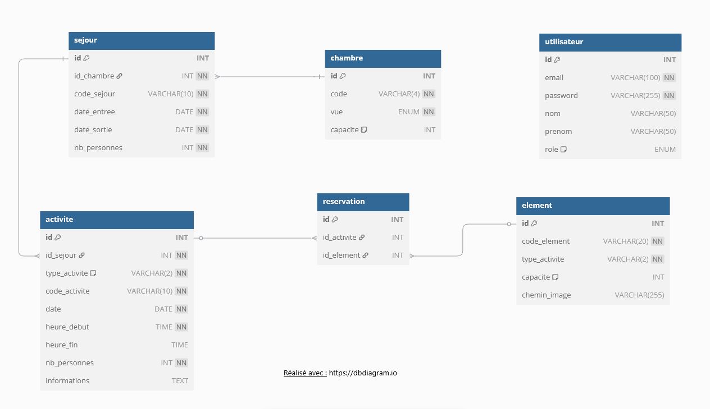

# Panneau d'administration pour le Gîte Pim

- Instruction du projet : [projet](./private/Instructions.md)
- Documentation du déploiement : [doc](./private/Deploiement.md)
- Site déployé via railway : [deploy](https://ecf-at2-production.up.railway.app)
- Schéma conceptuel : 

Voir l'image

### Base de donnée

- [x] Création de la BDD :
    - [X] **Activité**  (loisirs pour les clients du gîte)
    - [X] **Chambre**   (ressource de type chambre)
    - [X] **Élément**   (ressource pour activités)
    - [ ] **Groupe-client** ??
    - [X] **Réservation** (association entre activité et élément)
    - [X] **Séjour**    (réservation d'une chambre sur une période)
    - [X] **Utilisateur** (pour la connexion au panneau d'administration)
- [ ] Insertion des données :
    - [X] **Chambre**   (chambre + séjour)
    - [X] **Bagne**     (élément + activité)
    - [X] **Cheval**    (élément + activité + réservation)
    - [X] **Garderie**  (élément + activité)
    - [X] **Kayak**     (élément + activité + réservation)
    - [X] **Repas**     (élément + activité + réservation)
- [ ] Autres :
    - [X] Statistique - occupation chambre - par chambre
    - [X] Statistique - occupation chambre - par jour
    - [ ] Statistique - autres ???

### Fonctionnalités

- [ ] Réservations :
    - [X] **Consultation**
    - [ ] **Modification**
    - [ ] **Annulation**
- [ ] Gestion dynamique des disponibilités et ressources :
    - [ ] **Chambre** (notion de groupe)
    - [ ] **Repas** (ressource table + répartition groupe)
    - [ ] **Kayak** (kayak double + optimisation choix)
    - [ ] **Chevaux** (ressource cheval + gestion conflit ?)
- [ ] Statistiques :
    - [ ] Taux occupation par jour (chambre)
    - [ ] Taux occupation par jour (activité)
    - [ ] Taux occupation par tranche horaire (activité)
    - [ ] Autres ?
- [ ] Interface :
    - [X] Responsive ?
    - [X] Intuitive ?
- [X] Déploiement :
    - [X] Site d'hébergement
    - [X] Documentation liée
- [X] Authentification
- [X] Documentation du code
- [ ] partie "Front"

### Livrables

- [X] Site et panneau d’administration
    - [X] Lien du site
    - [X] Lien du dépôt Git
- [ ] Dossier projet (PDF)
    - [ ] Liste des compétences mobilisées (C1, C5, C6, C7, C8)
    - [ ] Expression du besoin, objectifs et limites du projet.
    - [ ] Environnement technique et humain, objectifs de qualité.
    - [ ] 1 Veille sécurité réalisée pendant le projet : vulnérabilités identifiées et corrigées.
    - [ ] 1 Réalisation significative côté backend avec justification argumentée des choix, notamment sécurité.
    - [ ] Présentation complète de la base de données :
        - [X] Schéma conceptuel (avec données et relations).
        - [X] Schéma physique.
        - [X] 1 Script de création ou modification de la base.
    - [ ] 1 Extrait de code d'un composant métier représentatif.
    - [ ] 1 Extrait de code d'un composant d'accès aux données.
    - [ ] Présentation d'1 élément de sécurité implémenté.
    - [ ] Présentation d'1 jeu d’essai élaboré par vous sur la fonctionnalité la plus représentative (données entrantes, attendues, obtenues) et analyse des éventuels écarts.
- [ ] Présentation orale (20 minutes)
    - [ ] Liste des compétences mises en œuvre.
    - [ ] Expression du besoin (objectifs et limites).
    - [ ] Environnement technique, humain, objectifs de qualité.
    - [ ] Contenu total du dossier projet adapté à une présentation orale.
    - [ ] Conclusion et bilan personnel.

### Compétences mobilisées

- [ ] C1 : Installer et configurer son environnement de travail selon le projet web.
    - [X] Mettre en place et utiliser un environnement de développement intégré, y compris en anglais
    - [X] Utiliser des outils collaboratifs de développement logiciel et de versionning de type git server
- [ ] C5 : Mettre en place une base de données relationnelle.
    - [X] Identifier et prendre en compte les données du schéma conceptuel et leurs relations
    - [ ] Construire le schéma logique des données
    - [ ] Construire le schéma physique des données
    - [X] Écrire et exécuter un script de création de base de données
    - [X] Définir et implémenter un jeu d’essai complet dans la base de tests
    - [X] Écouter, reformuler et faire la synthèse des besoins des utilisateurs
- [ ] C6 : Développer des composants d’accès aux données (SQL et NoSQL).
    - [ ] Coder de façon sécurisée les accès aux données relationnelles ou non relationnelles en consultation, création, mise à jour et suppression
    - [ ] Inclure dans les composants d’accès l’authentification et la gestion de la sécurité du SGDB
- [ ] C7 : Développer des composants métier côté serveur.
    - [ ] Coder dans un langage orienté objet avec un style défensif
    - [X] Développer en utilisant une architecture logicielle multicouche répartie sécurisée
    - [ ] Gérer la sécurité de l’application (authentification, permissions, validation des entrées...) dans la partie serveur
    - [X] Utiliser des composants d’accès aux données
    - [ ] Utiliser un service distant (Representational State Transfer Application Program Interface (API Rest)
    - [X] Améliorer à fonctionnalités constantes un code existant (refactoring)
    - [ ] Mettre en place un système de veille technologique permettant de suivre les principales évolutions technologiques et les problématiques de sécurité en lien avec les composants métier d’une application
    - [X] Documenter le code
- [ ] C8 : Documenter le déploiement d’une application dynamique web.
    - [X] Prendre en compte les dépendances du composant à déployer vis-à-vis des composants externes
    - [X] Rédiger la procédure de déploiement
